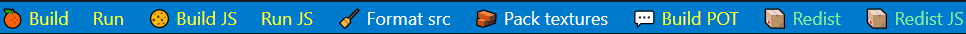

# About

**A lightweight and simple base structure for games, using *[Heaps](https://heaps.io)* framework  and *[Haxe](https://haxe.org)* language.**

Latest release notes: [View changelog](CHANGELOG.md).

# Install

## If you're a dev

1. Install **Haxe** and **Hashlink**: follow points 1, 2 and 5 of this [Step-by-step tutorial](https://deepnight.net/tutorial/a-quick-guide-to-installing-haxe/) from *Sébastien Bénard*
2. Clone this git into a local repositories (or fork it then clone)
3. Install required libs by running the following command **in the root of the repo**: `haxe setup.hxml`
4. Install Java (necessary for texture packing)
5. Open the repo with vscode
6. Press F1 (or Ctrl+Shift+P) then `Haxe: select configuration` and select build.dev.hxml
7. Run the task `Pack textures` or the script `tools/PackTexture.bat`
8. Press F5 to launch the game in debug or use the command bar buttons (see below)

## If you're an artist

1. Install **Haxe** and **Hashlink**: follow points 1 and 2 of this [Step-by-step tutorial](https://deepnight.net/tutorial/a-quick-guide-to-installing-haxe/) from *Sébastien Bénard*
2. Clone this git into a local repositories (or fork it then clone)
3. Install required libs by running the following command **in the root of the repo**: `haxe setup.hxml`
4. Install Java (necessary for texture packing)
5. Run the script `tools/PackTexture.bat`
6. Run the script `tools/RedistDebug.bat` to create an exe in the debug folder
7. Launch the exe in debug

# Compile

From the command line, run either:

 - For **DirectX**: `haxe build.directx.hxml`
 - For **OpenGL**: `haxe build.opengl.hxml`
 - For **Javascript/WebGL**: `haxe build.js.hxml`

The `build.dev.hxml` is just a shortcut to one of the previous ones, with added `-debug` flag.

Run the result with either:

 - For **DirectX/OpenGL**: `hl bin\client.hl`
 - For **Javascript**: `start run_js.html`

# Distribution

- Install Butler as described here : https://itch.io/docs/butler/installing.html
- Add it to your path 
- Execute the Redist task then the Butler or Steam one

# Tools and optionnal setup

## If you're a dev

- Visual Studio Code Command bar (id: gsppvo.vscode-commandbar) is recommended.
	
- gettext Language Support for Visual Studio Code (id: mrorz.language-gettext)

## Scripts (for everyone)

- After updating textures in the art folder, run the script `tools/PackTexture.sh`
- Same for the music but with the script `tools/PackMusic.sh`
- For artists, after fetching and pulling the last changes from the code, you can update the exe by running the script `tools/RedistDebug.sh`

## Database

We use [CastleDB](https://castledb.org/) for that. The file is `res/Data.cdb`.

## Localisation 

Execute `haxe tools.langParser.hxml`

For **localization support** (ie. translating your game texts), you may also check the [following guide](https://deepnight.net/tutorial/part-4-localize-texts-using-po-files/).

# Norms

We are using the UpperCamelCase for classes name. This means all worlds are next to each other without space and must start with an uppercase. Files and folders must be in lowerCamelCase (same but the first word has no starting uppercase) as well as variables and functions. 
`-` are used to differentiate file versions (*eg.* robot.png and robot-Blue.png or robot-Normal.png as well as robot-2.png).
`_` are used to add tags or indicate a frame (*eg.* robot_walk_1.png is the first frame of the walk anim)

# Questions & Resources

## Failed to load library hlimgui.hdll

Often a dll issue. Check that you have all of them in the root directory. Also make sure you have the latest version of the Visual Studio Build tools for C++ Desktop.

## Failed to connect on debug port

Try compiling by hand (`Run build task` in vscode or `haxe build.dev.hxml` command-line) then executing (`hl bin/client.hl` in command-line).

## Acquirable.hx:65: characters 7-20 : Null safety: Cannot return nullable value of Null<execute.T> as exe

Restart Language Server (`F1` or `Ctrl+Shift+P`)

## Exporting a new font

https://heaps.io/documentation/text.html
https://community.heaps.io/t/creating-bitmap-fonts-not-working-for-me/382/5

## Yanrishatum's "Unnoficial Heaps FAQ"

https://gist.github.com/Yanrishatum/ae3725a9e2b45e0766c065e573ed1f24

## Yanrishatum's "How to compile HL/C"

https://gist.github.com/Yanrishatum/d69ed72e368e35b18cbfca726d81279a

## Yanrishatum's "How to compile HL/CHXSL cheat-sheet"

https://gist.github.com/Yanrishatum/6eb2f6de05fc951599d5afccfab8d0a9

## Package and distribute with HashLink

https://github.com/HaxeFoundation/hashlink/wiki/Distribution-&--Packaging

## Optimizing bitmaps (excerpt from Heaps documentation)

- Use power of 2 sizes for textures
- For fast tile rendering, use h2d.TileGroup
- Have a lot of separate bitmaps? Combine them in one texture.
- For particle rendering, use h2d.SpriteBatch
- see https://heaps.io/documentation/drawing-tiles.html
- and https://heaps.io/documentation/resource-management.html

## Profiling

https://github.com/HaxeFoundation/hashlink/wiki/Profiler

# Credits & Resources

- [CastleDB](https://castledb.org/) for the game database
- [Codecks](https://codecks.io/) for the project management
- [LibGDX Texture Packer](https://github.com/libgdx/libgdx/wiki/Texture-packer) for packing texture
- [Krita](https://krita.org/) as an image editor
- [binding](https://github.com/grimo0/hlimgui) for [Dear ImGui](https://github.com/ocornut/imgui)
- [Simple Haxe wrapper](https://github.com/HeapsIO/hlsteam) of Steam API for Hashlink
- Debug font from Heaps samples
- [Open Dyslexic 3](https://opendyslexic.org/)
- Music `The Temperature of the Air on the Bow of the Kaleetan` made by [Chris Zabriskie](https://chriszabriskie.com/) (CC BY 4.0)